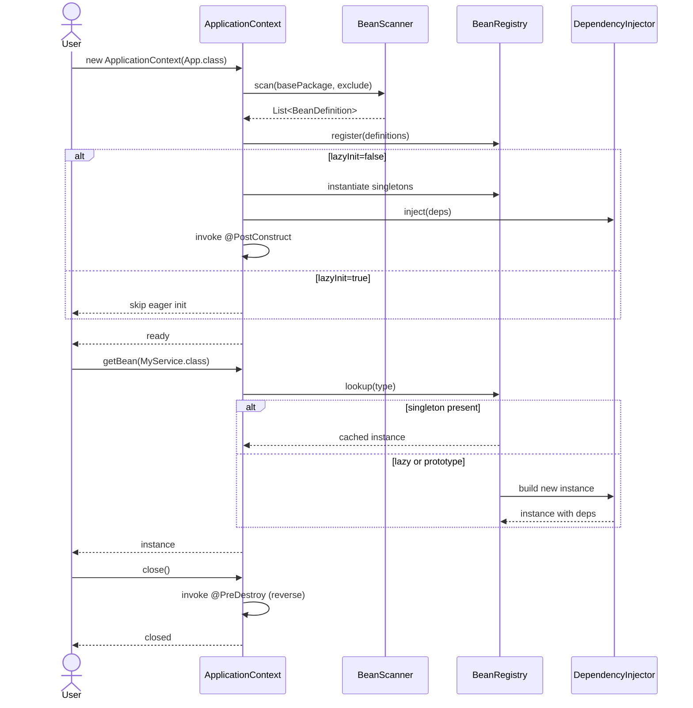

## Үндсэн модулиуд

```
mn.edu.num
├── annotation/         // @Component, @Service, @Autowired, @Qualifier, @Scope, @PostConstruct, ...
├── container/
│   ├── ApplicationContext         // facade — startup/shutdown
│   ├── ApplicationContextBuilder  // fluent API
│   ├── BeanScanner                // classpath scan
│   ├── BeanRegistry               // bean definition + cache
│   ├── DependencyInjector         // field/constructor injection
│   ├── ReflectionCache            // class metadata cache
│   └── visualize/DependencyTreeHtmlExporter
├── benchmark/          // BenchmarkRunner, Result, Report
├── exception/          // BeanCreationException, BeanScopeException, BeanNotFoundException
└── util/Levenshtein    // "did-you-mean" suggestion
```

## Контейнер lifecycle



## Хариуцлагын хуваарилалт

| Класс | Гол хариуцлага |
| --- | --- |
| `ApplicationContext` | Facade — startup/shutdown оркестрчиглэл, `getBean(...)`, `close()`. |
| `ApplicationContextBuilder` | Тохиргоог цуглуулж `ApplicationContext` constructor-руу дамжуулна. |
| `BeanScanner` | Classpath доорх класс файлуудыг **сорттой** дарааллаар уншиж stereotype annotation-той классуудыг буцаана. |
| `BeanRegistry` | `Map<String, BeanDefinition>`, `Map<String, Object>` (singleton cache), prototype factory. |
| `DependencyInjector` | `@Autowired` field/constructor бүрэн ажиллагаатай болгоно. `ReflectionCache`-аас metadata авна. |
| `ReflectionCache` | Класс тус бүрд field/constructor/method жагсаалтыг кэшилнэ. |
| `DependencyTreeHtmlExporter` | Bean graph-г HTML файл болгож хадгална, browser-аар нээнэ. |

## BeanRegistry дизайн

`BeanRegistry` нь дараах structure-уудыг хадгална:

| Field | Тайлбар |
| --- | --- |
| `definitions: Map<String, BeanDefinition>` | bean ID → definition |
| `singletons: ConcurrentHashMap<String, Object>` | singleton кэш |
| `creating: Set<String>` | циклик dependency илрүүлэх stack |
| `creationOrder: List<String>` | `@PreDestroy` reverse iteration-нд ашиглана |

Bean олох:

1. ID-аар хайх → шууд definition авна
2. Тип, interface-аар хайх → matching definition-уудаас 1-ийг сонгоно (`@Qualifier` шаардлагатай үед)

Олон тохирол байвал `BeanCreationException("Multiple beans of type ...")` шидэгдэнэ.

## Scanner дизайн

`BeanScanner` нь classpath дээр `.class` файл хайгаад `Class.forName(...)`-р ачаална. Файл
жагсаалтыг **`Files.list(...).sorted()`** хийж reproduceable дараалал гаргахаар сольсон.
Энэ нь:

- Test-ийн flakiness шийдсэн (өмнө `BeanCreationIntegrationTest` нь файл систем-аас
  хамаарч failed/passed solih байсан).
- CI-д тогтвортой `creationOrder` гаргана → `@PreDestroy` reverse order ч мөн determined.

## Гадаад дотоод зэрэг

- **Public API**: `ApplicationContext`, `ApplicationContextBuilder`, annotation-ууд, exception-ууд.
- **Internal**: `BeanScanner`, `BeanRegistry`, `DependencyInjector`, `ReflectionCache`. Энэ class-уудыг шууд хэрэглэгч ашиглах ёсгүй (`@ApiNote`-аар тэмдэглэж болно).

[Design decisions](/architecture/design-decisions) хуудаснаас тус бүрийн сонголтын
шалтгаанаа уншина уу.
